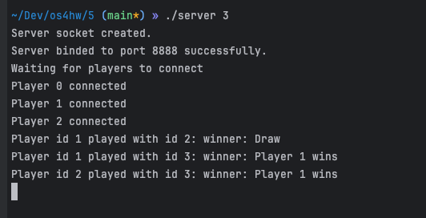

# Отчет
_Китаев Никита Алексеевич_
_БПИ223_

**Вариант 35** «Камень, ножницы, бумага» 1 — однокруговая система.
N cтудентов, изнывающих от скуки на лекции по операционным
системам решили организовать однокруговой турнир в игру «Ка-
мень, ножницы, бумага». Каждый с каждым при этом играет толь-
ко один раз. За победу дается два очка, за ничью — одно, за пора-
жение — ноль.
Требуется создать клиент–серверное приложение, моде-
лирующее турнир.
Каждый студент — отдельный клиент. Генерация камня, нож-
ниц и бумаги в каждом поединке формируется сервером случай-
но. Завершение работы программ осуществляется по завершению турнира. Количество участвующих студентов задается серве-
ром.

Работа выполнена на оценку 7.
## Краткое описание
### Компиляция
```
gcc player.c -o player
gcc server.c -o server
```
или
```
bash ./compile.sh
```
### Запуск
```
./server <N>
./player 
./player
...
./print
```
или
```
./server <IP> <PORT> <N>
./player <IP> <PORT>
./player <IP> <PORT>
...
./print <IP> <PORT>
```
### Описание

#### Сценарий решаемой задачи

В данном проекте реализован сервер, который организует турнир по игре "Камень, Ножницы, Бумага" между N игроками, и клиенты, которые участвуют в турнире. Также был добавлен клиент, который выводит информацию о ходе игры.

### Работа на оценку 4-5

#### Исходные сущности и их поведение
* **Сервер:**
Принимает подключения от N игроков.
Проводит турнир, организуя игры между игроками.
Информирует клиента-зрителя о ходе игры.


* **Игроки (клиенты):**
Подключаются к серверу.
Участвуют в турнире, отправляя и принимая запросы на игру.


* **Клиент-зритель:**
Подключается к серверу и получает информацию о ходе игры.

#### Взаимодействие серверов, клиентов и процессов
* **Сервер:**

    * Создает сокет и привязывается к порту.
    * Принимает подключения от игроков.
    * Отправляет игрокам их идентификаторы и количество игроков в турнире.
    * Организует игры между игроками.
    * Отправляет информацию о ходе турнира


*  **Игроки (клиенты):**

    * Создают сокет и подключаются к серверу.
    * Принимают свои идентификаторы и количество игроков.
    * Участвуют в играх, отправляя запросы на бой и получая результаты.

#### Результаты работы программы




### Работа на оценку 6-7
### Компиляция
```
gcc player.c -o player
gcc server.c -o server
gcc print.c -o print
```
или
```
bash ./compile.sh
```
### Запуск
```
./server <N>
./player 
./player
...
./print
```
или
```
./server <IP> <PORT> <N>
./player <IP> <PORT>
./player <IP> <PORT>
...
./print <IP> <PORT>
```

### Исходные сущности и их поведение
* **Клиент-зритель:**
    * Создает сокет и подключается к серверу.
    * Получает информацию о ходе игры и выводит ее на экран.

### Модификации
* **Клиент-зритель:**
Был добавлен клиент-зритель, который подключается к серверу, получает информацию о ходе турнира и выводит ее на экран.

* **Сервер:**
Добавлена отправка сообщений о результатах каждого боя и состоянии турнира.

#### Результаты работы программы


