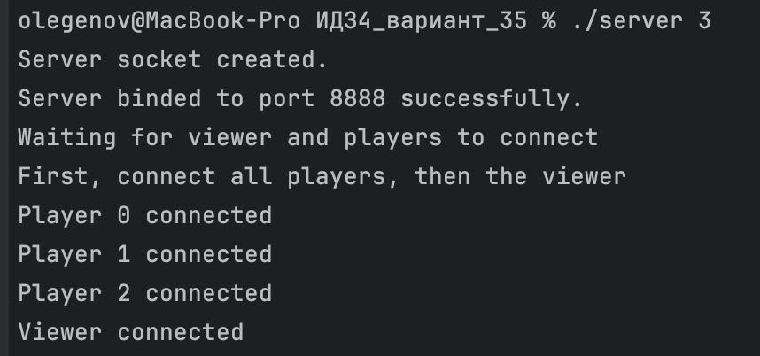
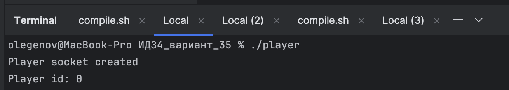

# Отчет
_Китаев Никита Алексеевич_
_БПИ223_

**Вариант 35**

Работа выполнена на оценку 7.
## Краткое описание
### Компиляция
```
gcc player.c -o player
gcc server.c -o server
gcc print.c -o print
```
или
```
bash ./complie.sh
```
### Запуск
```
./server <N>
./player 
./player
...
./print
```
или
```
./server <IP> <PORT> <N>
./player <IP> <PORT>
./player <IP> <PORT>
...
./print <IP> <PORT>
```
### Описание
#### Сценарий решаемой задачи

В данном проекте реализован сервер, который организует турнир по игре "Камень, Ножницы, Бумага" между N игроками, и клиенты, которые участвуют в турнире. Также был добавлен клиент, который выводит информацию о ходе игры.

#### Исходные сущности и их поведение
* **Сервер:**
Принимает подключения от N игроков.
Проводит турнир, организуя игры между игроками.
Информирует клиента-зрителя о ходе игры.


* **Игроки (клиенты):**
Подключаются к серверу.
Участвуют в турнире, отправляя и принимая запросы на игру.


* **Клиент-зритель:**
Подключается к серверу и получает информацию о ходе игры.

#### Взаимодействие серверов, клиентов и процессов
* **Сервер:**

    * Создает сокет и привязывается к порту.
    * Принимает подключения от игроков.
    * Отправляет игрокам их идентификаторы и количество игроков в турнире.
    * Организует игры между игроками.
    * Отправляет информацию о ходе турнира клиенту-зрителю.


*  **Игроки (клиенты):**

    * Создают сокет и подключаются к серверу.
    * Принимают свои идентификаторы и количество игроков.
    * Участвуют в играх, отправляя запросы на бой и получая результаты.


* **Клиент-зритель:**

    * Создает сокет и подключается к серверу.
    * Получает информацию о ходе игры и выводит ее на экран.

#### Модификации

* **Клиент-зритель:**
Был добавлен клиент-зритель, который подключается к серверу, получает информацию о ходе турнира и выводит ее на экран.


* **Сервер:**
Добавлена отправка сообщений о результатах каждого боя и состоянии турнира.

#### Результаты работы программы

server
```
Server socket created.
Server binded to port 8888 successfully.
Waiting for viewer and players to connect
First, connect all players, then the viewer
Player 0 connected
Player 1 connected
Player 2 connected
Viewer connected
```

player
```
Player socket created
Player id: 0
```

printer
```
Viewer socket created.
Tournament begins!

Player #1 plays with player #2
Player #1: paper. Player #2: paper.    1:1
Tournament: 
-1 1 -1 
1 -1 -1 
-1 -1 -1 

Player #1 plays with player #3
Player #1: rock. Player #3: scissors.    2:0
Tournament: 
-1 1 0 
1 -1 -1 
2 -1 -1 

Player #2 plays with player #3
Player #2: scissors. Player #3: rock.    0:2
Tournament: 
-1 1 0 
1 -1 2 
2 0 -1 
```







